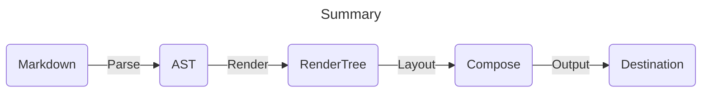
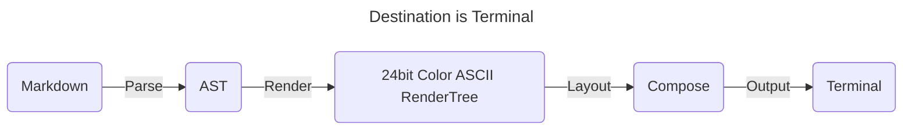
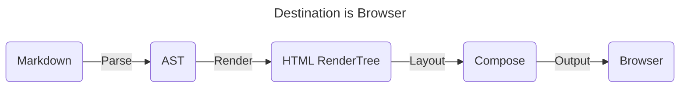
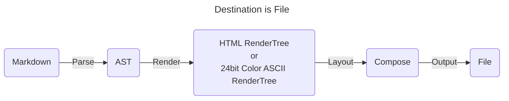

# Architecture

```mermaid
---
title: Summary
---
flowchart LR
    md(Markdown)
    ast(AST)
    rt(RenderTree)
    cm(Compose)
    dst(Destination)

    md -- Parse --> ast
    ast -- Render --> rt
    rt -- Layout --> cm
    cm -- Output --> dst
```

```mermaid
---
title: Destination is Terminal
---
flowchart LR
    md(Markdown)
    ast(AST)
    rt(24bit Color ASCII RenderTree)
    cm(Compose)
    dst(Terminal)

    md -- Parse --> ast
    ast -- Render --> rt
    rt -- Layout --> cm
    cm -- Output --> dst
```

```mermaid
---
title: Destination is Browser
---
flowchart LR
    md(Markdown)
    ast(AST)
    rt(HTML RenderTree)
    cm(Compose)
    dst(Browser)

    md -- Parse --> ast
    ast -- Render --> rt
    rt -- Layout --> cm
    cm -- Output --> dst
```

```mermaid
---
title: Destination is File
---
flowchart LR
    md(Markdown)
    ast(AST)
    rt(HTML RenderTree\nor\n24bit Color ASCII RenderTree)
    cm(Compose)
    dst(File)

    md -- Parse --> ast
    ast -- Render --> rt
    rt -- Layout --> cm
    cm -- Output --> dst
```

when destination is file, not update preview. 